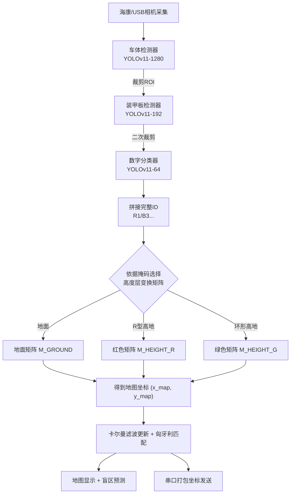

# Radar26 Final · 面向 RoboMaster 2026 赛季的全自动雷达视觉与决策辅助系统


> 基于海康工业相机（兼容 USB 相机）的 RoboMaster 雷达站上位机系统。  
> 通过 **YOLOv11 三层级联检测** → **卡尔曼滤波 + 匈牙利算法跟踪** → **多高度层坐标映射**，实现对敌方机器人 **实时定位、ID 识别与运动预测**，并通过串口将战场态势上报给决策模块。  
> 支持 **TensorRT 引擎加速**、**盲区智能预测**、**地图掩码编辑器**及 **双阵营适配**（红/蓝方），适用于 **RoboMaster 2026 赛季** 的雷达站开发与竞赛场景。

---

## 📖 目录

1. [系统特性](#系统特性)  
2. [视觉检测与定位流水线](#视觉检测与定位流水线)  
3. [项目结构](#项目结构)  
4. [环境与依赖](#环境与依赖)  
5. [快速开始](#快速开始)  
   - [5.1 安装基础依赖](#51-安装基础依赖)  
   - [5.2 准备模型与资源文件](#52-准备模型与资源文件)  
   - [5.3 修改主配置文件](#53-修改主配置文件)  
   - [5.4 启动系统](#54-启动系统)  
6. [相机标定与多高度层映射](#相机标定与多高度层映射)  
7. [模型训练与 TensorRT 导出](#模型训练与-tensorrt-导出)  
8. [辅助工具与脚本](#辅助工具与脚本)  
9. [串口通信协议](#串口通信协议)  
10. [运行截图与调试](#运行截图与调试)  
11. [许可证](#许可证)  
12. [致谢](#致谢)  

---

## 系统特性

- **三层级联神经网络**  
  `车体检测(1280×1280)` → `装甲板检测(192×192)` → `数字分类(64×64)`，由粗到细快速推断敌方机器人完整 ID（如 R1、B3、R7 等）。

- **硬件加速推理**  
  使用 TensorRT FP16 静态引擎，在 NVIDIA Jetson / 独立 GPU 上稳定达到 **60 FPS 以上** 的检测速度。

- **鲁棒的多目标跟踪**  
  自研 2D 卡尔曼滤波器（位置 + 速度）与匈牙利算法匹配检测框，可应对短暂遮挡、漏检等场景，并在长时未观测后自动清除丢失目标。

- **多高度层坐标变换**  
  利用掩码图像自动区分地面、R 型高地、环形高地，并加载三组透视变换矩阵，将图像下边缘中心点精确映射至 **2800×1500** 的地图坐标系。

- **盲区预测**  
  基于历史轨迹的速度方向与预设盲区点位，对敌方消失后的可能位置进行实时评分排序，提升决策的持续性。

- **全自动串口通信**  
  定时打包整场敌方坐标发送给下位机，同时接收裁判系统返回的进度条、双倍易伤、飞镖目标等信息，并在 UI 动态展示。

- **可视化调试窗口**  
  实时显示：① 原始图像 + 检测框 + 数字识别结果；② 战场地图 + 敌方位置 + 速度矢量；③ 裁判系统血量/进度条面板。支持按键截图、暂停、重置跟踪器等操作。

- **地图掩码编辑器**  
  基于 PyQt5 的图形化工具，可直接在 2800×1500 地图上绘制多边形填充区域（高度层），并导出为掩码图片供标定使用。

---

## 视觉检测与定位流水线



---

## 项目结构

```
Radar26_Final/
├── V1/                           # 主工作目录
│   ├── main.py                   # ★ 主程序入口
│   ├── detect_function_yolov11.py # 检测器/分类器封装 (YOLOv11)
│   ├── hik_camera.py             # 海康相机SDK封装 (Windows/Linux)
│   ├── information_ui.py         # 裁判系统进度条绘制
│   ├── guess_plt.py              # 盲区预测算法
│   ├── train.py                  # 模型训练脚本
│   ├── onnx2engine.py            # ONNX→TensorRT引擎导出
│   ├── calibration.py            # 旧版标定UI (基于PyQt5)
│   ├── biao.py                   # 9点标定矩阵计算
│   ├── check.py                  # 标定点对可视化检查
│   ├── map.py                    # 纯色地图生成工具
│   ├── PNG_draw.py               # 地图掩码编辑器 (PyQt5)
│   ├── devide.py                 # 数据集划分脚本
│   ├── teat.py                   # 离线视频测试工具
│   ├── NEXT-E_axis.py            # 盲区点位可视化
│   ├── modelEEE/                 # ⚠️ 需自行准备模型文件
│   │   ├── car_1280_best.engine  #   车体检测 TensorRT引擎
│   │   ├── armorm_192_best.engine#   装甲板检测 TensorRT引擎
│   │   ├── cls_64_best.engine    #   数字分类 TensorRT引擎
│   │   └── *.pt / *.onnx         #   训练中间产物
│   ├── images/                   # 地图与掩码资源
│   │   ├── 2025map.png           # 战场地图 (2800x1500)
│   │   ├── 2025map_red.png       # 红方视角地图
│   │   ├── 2025map_blue.png      # 蓝方视角地图
│   │   ├── 2025map_mask.png      # 蓝方高度层掩码
│   │   ├── map_mask.jpg          # 红方高度层掩码
│   │   └── test.mp4 / test.jpg   # 测试素材
│   ├── arrays_test_red.npy       # 红方三维标定矩阵
│   ├── arrays_test_blue.npy      # 蓝方三维标定矩阵
│   ├── arrays_test.npy           # 地面层矩阵
│   ├── yaml/                     # 数据集配置文件
│   │   ├── car.yaml
│   │   ├── armor.yaml
│   │   └── armor_classify.yaml
│   ├── RM_serial_py/             # 串口通信子模块
│   ├── MvImport_Linux/           # 海康相机 Linux SDK 封装
│   └── MvImport/                 # 海康相机 Windows SDK 封装
└── README.md                     # 本文件
```

---

## 环境与依赖

| 依赖项 | 版本建议 | 说明 |
|--------|----------|------|
| Python | ≥3.8 (推荐 3.9) | 基础解释器 |
| PyTorch | ≥2.0.0 | GPU 版本，需与 CUDA 匹配 |
| Ultralytics | 8.3.x (YOLOv11) | 模型加载与训练 |
| OpenCV-Python | ≥4.5.0 | 图像处理与显示 |
| NumPy | ≥1.21.0 | 数值计算 |
| Matplotlib | ≥3.3.0 | 标定点可视化 |
| pyserial | ≥3.5 | 串口通信 |
| PyQt5 | ≥5.15 | 标定UI与掩码编辑器 |
| TensorRT | ≥8.6 | 模型推理加速（可选） |
| CUDA / cuDNN | 与 PyTorch / TensorRT 匹配 |  |

> **海康工业相机** 需额外安装官方 MVS 驱动与 SDK，并将 `libMvCameraControl.so` 放置到 `MvImport_Linux/` 目录下（Linux）或确保 DLL 可访问（Windows）。

---

## 快速开始

### 5.1 安装基础依赖

```bash
# 创建虚拟环境（推荐）
python3.9 -m venv radar_env
source radar_env/bin/activate

# 安装 PyTorch（CUDA 11.8 示例）
pip install torch torchvision torchaudio --index-url https://download.pytorch.org/whl/cu118

# 安装其他依赖
pip install ultralytics opencv-python numpy matplotlib pyserial PyQt5
```

若使用 TensorRT 引擎，需根据 [NVIDIA 官方指引](https://developer.nvidia.com/tensorrt) 安装 TensorRT 及 Python 绑定。

### 5.2 准备模型与资源文件

1. **模型文件**  
   将训练好的 TensorRT 引擎文件放入 `V1/modelEEE/`，确保文件名与 `main.py` 加载路径一致：
   ```
   modelEEE/car_1280_best.engine
   modelEEE/armorm_192_best.engine
   modelEEE/cls_64_best.engine
   ```
   若暂未导出 TensorRT，可先用 `.pt` 权重，需修改 `main.py` 中的 `weights_path` 并删除 `.engine` 相关逻辑（模型会自动回退到 PyTorch 推理）。

2. **标定矩阵**  
   通过标定流程生成以下文件并放入 `V1/`：
   - `arrays_test.npy` （地面层矩阵）
   - `arrays_test_red.npy` （红方高地矩阵）
   - `arrays_test_blue.npy` （蓝方高地矩阵）

3. **地图与掩码**  
   将官方 2800×1500 地图放入 `V1/images/`，并准备掩码图：
   ```
   images/2025map.png
   images/2025map_red.png
   images/2025map_blue.png
   images/map_mask.jpg           # 红方高度层掩码
   images/2025map_mask.png       # 蓝方高度层掩码
   ```

### 5.3 修改主配置文件

编辑 `main.py` 前部的全局配置区，根据实际环境调整：

```python
STATE = 'R'                     # 阵营：'R' 红方，'B' 蓝方
USART = 1                       # 1 开启串口，0 关闭
USER_COM = "/dev/ttyUSB0"       # 串口设备路径
USER_MODE = 'hik'               # 'hik' 海康相机, 'video' USB相机, 'test' 本地文件
USER_MAP = 'images/2025map.png'
USER_IMG_TEST = 'images/test.mp4'  # 测试模式下的文件路径

# 海康相机曝光与增益
USER_EXPOSURE_TIME = 8000
USER_GAIN = 16.0

# 录像开关
SAVE_IMG = 0                    # 1 开启录像
GAME_DIR = "game1"              # 录像文件夹名称
```

### 5.4 启动系统

```bash
cd V1
python main.py
```

运行后将弹出四个 OpenCV 窗口：
- `img`：原始图像 + 检测框 + 分类结果
- `map`：战场地图 + 敌方位置 + 速度箭头
- `information_ui`：裁判系统血量/进度条
- 可能还有调试窗口（按需）

**交互按键**（在 `img` 窗口有效）：
| 按键 | 功能 |
|------|------|
| `q` 或 `ESC` | 退出程序 |
| `s` | 保存当前帧截图 |
| `r` | 重置所有跟踪器 |
| `p` | 暂停 / 继续 |
| `d` | 调试模式切换 |

---

## 相机标定与多高度层映射

系统采用 **三层透视变换** 处理不同高度层的坐标映射。

### 标定流程概要

1. **采集图像点**  
   将标定板放置在场地内，运行相机并记录至少 9 个已知地图坐标的点位在图像中的像素坐标。

2. **计算变换矩阵**  
   使用 `biao.py` 脚本，输入图像点与对应的地图点，可求得 2D 仿射/透视变换矩阵。  
   针对不同高度层（地面、红色高地、蓝色高地），分别执行三次标定，生成三组 `.npy` 文件。

3. **生成高度层掩码**  
   使用 `PNG_draw.py` 编辑器，在地图上用 **绿色** 填充 R 型高地、**蓝色** 填充环形高地区域，其余为黑色（地面）。保存为掩码图 `map_mask.jpg`。

4. **自动切换矩阵**  
   运行时，系统将图像坐标先经地面矩阵映射，再读取映射点的掩码颜色：
   - 黑色 → 使用地面矩阵
   - 绿色 → 使用红方高地矩阵
   - 蓝色 → 使用蓝方高地矩阵
   从而准确获得真实地图坐标。

---

## 模型训练与 TensorRT 导出

### 训练

1. **准备数据集**  
   按照 YOLO 格式组织数据，使用 `devide.py` 划分训练集/验证集/测试集。  
   修改 `yaml/` 下的配置文件中的数据路径。
   - `car.yaml`：类别 `['car','armor','ignore','watcher','base']`
   - `armor.yaml`：类别 `['armor_red','armor_blue','armor_other']`
   - `armor_classify.yaml`：类别 `['B0','B1',...,'R5','RS']` 共 14 类

2. **启动训练**  
   ```bash
   python train.py
   ```
   可在 `train.py` 中调整 `epochs`, `batch`, `imgsz` 等超参数。训练默认从 `yolo11n.pt` 预训练权重开始。

### 导出 TensorRT 引擎

训练完成后得到 `.pt` 权重，使用 `onnx2engine.py` 一键导出为 TensorRT 引擎：

```bash
python onnx2engine.py
```

该脚本自动调用 `model.export(format='engine', half=True, ...)`，生成固定尺寸（640/192/64）的 FP16 引擎。  
导出成功后，将 `.engine` 文件复制到 `modelEEE/` 文件夹即可被 `main.py` 加载。

> **注意**：导出前请确保 JetPack / TensorRT 环境已正确安装，且 GPU 支持 FP16。

---

## 辅助工具与脚本

| 脚本 | 功能 |
|------|------|
| `teat.py` | 离线视频/图片测试，验证三层检测准确率，包含帧率稳定控制 |
| `guess_plt.py` | 盲区预测算法原理演示与可视化 |
| `NEXT-E_axis.py` | 在地图上绘制盲区点位及其同心圆，便于标注和调试 |
| `PNG_draw.py` | 图形化地图掩码编辑器，可绘制多边形填充区并导出掩码图 |
| `devide.py` | 自动划分数据集（train/val/test） |
| `calibration.py` | 旧版标定 UI，支持手动点击采集标定点并计算矩阵 |
| `check.py` | 标定点对可视化检查，确保图像点与地图点一一对应 |
| `map.py` | 创建纯色测试图片，辅助开发调试 |

---

## 串口通信协议

- **发送**（雷达 → 下位机）：  
  整场敌方坐标按固定周期打包，格式由 `build_data_radar_all()` 生成，包含敌方 ID 及地图坐标（已根据阵营自动转换坐标系）。

- **接收**（下位机 → 雷达）：  
  解析裁判系统数据，包括：
  - 机器人血量/进度条信息（`progress_cmd_id`）
  - 双倍易伤触发状态（`vulnerability_cmd_id`）
  - 当前飞镖瞄准目标（`target_cmd_id`）
  解析结果通过 `information_ui.py` 在 UI 面板上绘制。

---

## 运行截图与调试

- **主窗口**：实时显示检测框、装甲板分类、数字识别结果  
  <p align="center">
    
  </p>

- **地图界面**：敌方机器人位置（圆形）、速度矢量（箭头）、ID 标签  
  <p align="center">
    
  </p>

- **裁判信息面板**：血量条、双倍易伤指示、进度条等  
  <p align="center">
    
  </p>

> 以上截图替换为您的实际运行画面，存放于 `V1/images/` 中即可。

---

## 许可证

本项目采用 [MIT License](LICENSE) 开源，第三方组件（Ultralytics、海康机器人 SDK 等）遵循各自许可协议。

---

## 致谢

- [Ultralytics YOLO](https://github.com/ultralytics/ultralytics) 提供强大的目标检测与分类框架。
- 海康机器人提供工业相机 SDK 及技术支持。
- 项目灵感来源于 RoboMaster 官方开源资料与社区贡献者的经验分享。
- 感谢全体团队成员在算法设计、硬件调试与赛场测试中的不懈努力。

---

**项目作者**：Nidhogg-max  
**联系邮箱**：1632741446@qq.com  
**最后更新**：2026-05-07
```
